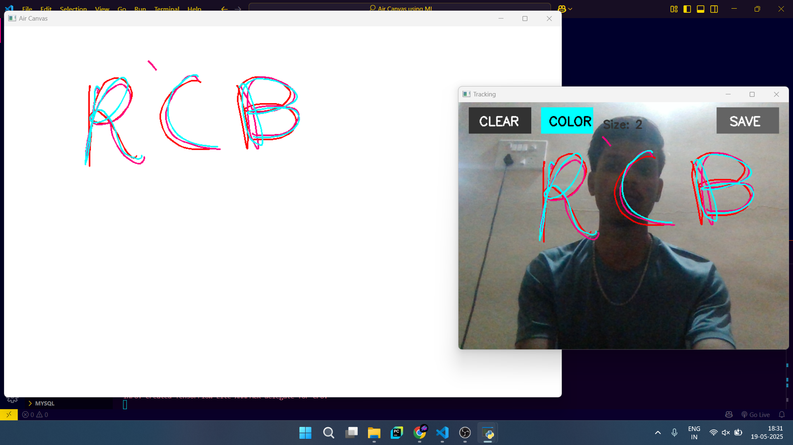
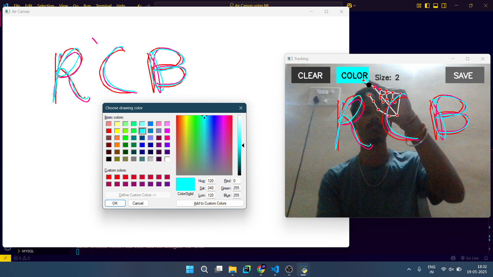
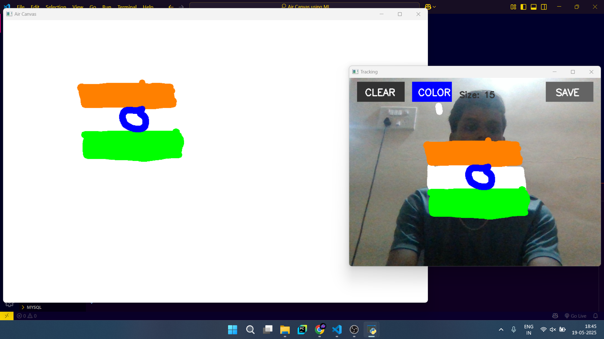
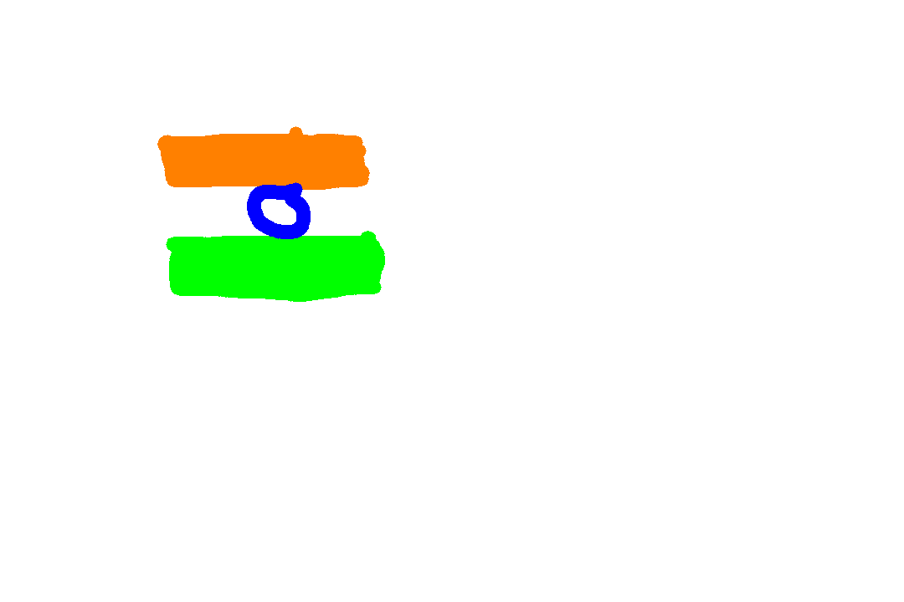

# Air Canvas: Interactive Drawing with Hand Gestures

## Table of Contents
- [Overview](#overview)
- [Demo](#demo)
- [Key Features](#key-features)
- [Technical Requirements](#technical-requirements)
- [Installation Guide](#installation-guide)
- [Usage Instructions](#usage-instructions)
- [How It Works](#how-it-works)
- [Project Structure](#project-structure)
- [Troubleshooting](#troubleshooting)
- [Future Enhancements](#future-enhancements)
- [License](#license)
- [Acknowledgments](#acknowledgments)

## Overview

Air Canvas is an interactive computer vision application that enables users to draw in the air using hand gestures. By leveraging OpenCV for image processing and MediaPipe for precise hand tracking, this application creates a virtual canvas where your index finger becomes the brush, controlled entirely through natural hand movements.

## Demo

### Screenshots









### Video Demo
[Watch the Air Canvas in action](https://youtube.com/watch?v=your-video-id)

## Key Features

- **Intuitive Drawing Interface**: Draw naturally using hand gestures captured by your webcam
- **Gesture Control**: Toggle drawing on/off with simple pinch gestures
- **Color Selection**: Choose from a wide range of colors via an interactive color picker
- **Brush Size Adjustment**: Customize your drawing experience with adjustable brush sizes
- **Canvas Management**: Clear your canvas or save your creations as PNG files
- **Smooth Drawing Experience**: Optimized tracking algorithms for fluid and accurate drawing

## Technical Requirements

- **Python**: 3.8 or higher
- **Libraries**:
  - [OpenCV](https://opencv.org/): For image processing and canvas management
  - [MediaPipe](https://mediapipe.dev/): For hand tracking and gesture recognition
  - [NumPy](https://numpy.org/): For numerical operations
  - [tkinter](https://docs.python.org/3/library/tkinter.html): For the color picker interface
- **Hardware**: Webcam with clear resolution

## Installation Guide

### 1. Clone the Repository

```bash
git clone https://github.com/yourusername/Air-Canvas-using-ML.git
cd Air-Canvas-using-ML
```

### 2. Set Up a Python Environment (Optional but Recommended)

```bash
python -m venv venv
# On Windows
venv\Scripts\activate
# On macOS/Linux
source venv/bin/activate
```

### 3. Install Dependencies

```bash
pip install -r requirements.txt
```

## Usage Instructions

### Starting the Application

```bash
python code/air_canvas.py
```

### Interface Controls

#### Gesture Controls
- **Drawing Mode**: When your hand is detected, drawing is toggled based on the distance between your thumb and index finger
  - **Pinch Open** (≥ 40px distance): Drawing enabled
  - **Pinch Closed** (< 40px distance): Drawing disabled
- **Cursor**: Your index fingertip position is tracked and displayed as a black circle

#### On-Screen Buttons
- **CLEAR**: Resets the canvas to blank
- **COLOR**: Opens a color picker dialog to select a new drawing color
- **SAVE**: Saves your artwork as a timestamped PNG file

#### Keyboard Controls
- **+** or **=**: Increase brush size
- **-**: Decrease brush size
- **q**: Quit the application

## How It Works

### Technical Architecture

1. **Video Capture**: Webcam feed is captured and processed frame by frame
2. **Hand Detection**: MediaPipe's hand tracking solution identifies hand landmarks in real-time
3. **Gesture Recognition**: 
   - The positions of the index fingertip and thumb tip are tracked
   - The distance between these points determines if drawing is enabled
4. **Drawing Mechanism**:
   - A deque data structure stores points for each color
   - When drawing is enabled, the tracked position is added to the current color's deque
   - Lines are drawn between consecutive points in the deque
5. **Dual Canvas System**:
   - A persistent canvas maintains the complete drawing
   - A temporary canvas is used for display in each frame

### Interaction Flow

1. User's hand is detected and tracked in the webcam feed
2. Index fingertip position is smoothed to reduce jitter
3. Pinch gesture toggles drawing mode on/off
4. When drawing is enabled, the path of the index finger is traced on the canvas
5. On-screen buttons provide additional functionality
6. Drawings can be saved as PNG files with timestamps

## Project Structure

```
Air-Canvas-using-ML/
├── code/
│   ├── air_canvas.py       # Main application code
│   └── color_palette.py   # Color picker implementation
├── assets/                # Directory for project assets
│   ├── SS-1.png          # Screenshot 1
│   ├── SS-2.png          # Screenshot 2
│   ├── SS-3.png          # Screenshot 3
│   └── air_canvas_*.png  # Drawing examples
├── requirements.txt       # Project dependencies
├── README.md              # Project documentation
└── air_canvas_*.png       # Saved drawing examples
```

## Troubleshooting

| Issue | Solution |
|-------|----------|
| Hand not detected | Ensure adequate lighting and position your hand clearly in the webcam's view |
| Unstable tracking | Try adjusting your distance from the camera (typically 1-2 feet works best) |
| Color picker not working | Verify tkinter is properly installed with your Python distribution |
| Drawing appears jerky | Slow down your hand movements for smoother lines |
| Application crashes | Check webcam permissions and ensure all dependencies are installed correctly |

## Future Enhancements

- Multi-hand support for collaborative drawing
- Additional drawing tools (shapes, erasers)
- Background customization options
- Recording and replay of drawing sessions
- Export to different file formats

## License

This project is released under the MIT License.

## Acknowledgments

- The [MediaPipe](https://mediapipe.dev/) team for their exceptional hand tracking library
- [OpenCV](https://opencv.org/) community for their powerful computer vision tools
- Contributors to this project for their valuable input and feedback 
